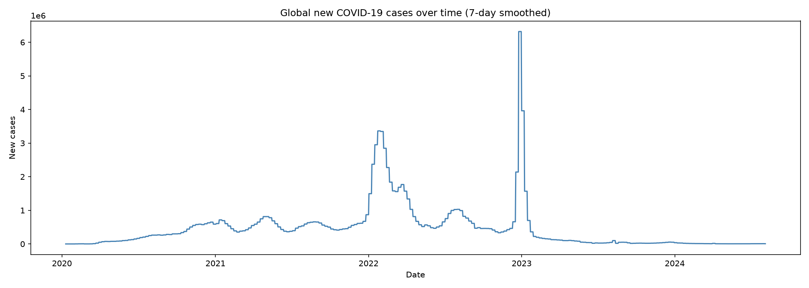
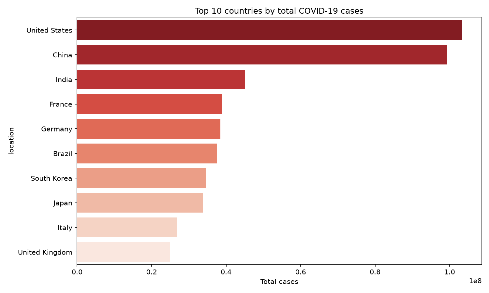
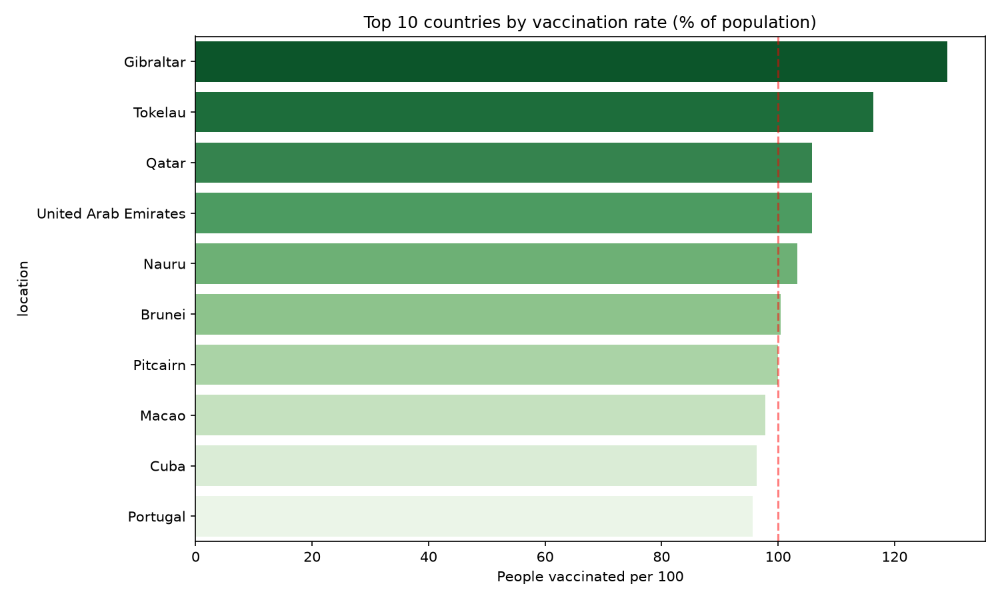
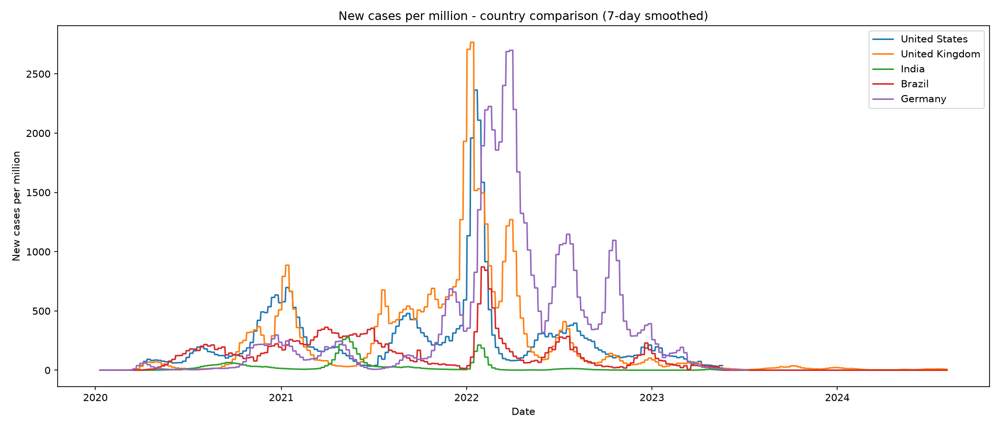

# COVID-19 Global Dashboard

An interactive public health dashboard tracking COVID-19 trends across 200+ countries, built with Python and Streamlit. Data is pulled live from Our World in Data's open COVID-19 dataset.

**[Live Dashboard](https://covid-dashboard-b5rb4hducukvnm7snjnbmn.streamlit.app/)**

## Key findings

+ The US, India, and Brazil recorded the highest total case counts globally
+ There were waves of spikes in global cases in late 2020, early 2022, and early 2023
+ The wealthier nations apeared to be vaccinated faster than the lower income countries
+ Case fatality rates defer widly by country due to how each country ran
+ The per-million normalization revealed that the smaller European nations were often hit harder when compared to other nations

## Dashboard features
+ Global trend chart with switchable metrics (cases, deaths, vaccinations)
+ Multi-country comparison with per-million normalization
+ Country deep dive with total cases, deaths, and vaccination
+ Sortable top 20 countries table
+ All charts interactive via Plotly - hover, zoom, and filter

## Visualizations






## How to run it locally
```bash
git clone https://github.com/jfpennington/Covid-Dashboard.git
cd Covid-Dashboard
ptyhin -m venv venv
venv\Scripts\activate
pip install -r requirements.txt
streamlit run app.py
```

## How to run the notebooks
Open Jupyter and run the notebooks in order:
1. `notebooks/01_exploration.ipynb` - data loading and structure
2. `notebooks/02_analysis.ipynb` - charts and country comparisons

## Dataset
[Our World in Data COVID-19 Dataset](https://github.com/owid/covis-19-data)
Updated regularly - data is pulled live each time the app loads.
Covers cases, deaths, vaccinations, hospitalizations, and testing across 200+ countries from January 2020 onward.

## Tools
Python * pandas * numpy * matplotlib * seaborn * plotly * Streamlit * Jupyter